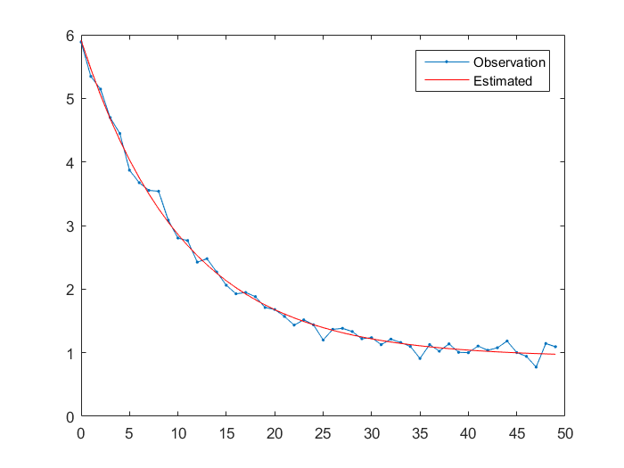

# Optimization

Test of Levenberg-Marquardt nonlinear least squares algorithms

* Results from known Jacobian (the first derivative) of the function


## Run examples
```
Samples with parameters (5.0, 0.1, 1.0)

With Jacobian
Levenberg-Marquardt returned in 14 iter, reason 2, sumsq 0.441433 [137.625]
Best fit parameters: 4.957659	0.09761961	0.986824

Without Jacobian
Levenberg-Marquardt returned in 59 iter, reason 2, sumsq 0.441433 [137.625]
Best fit parameters: 4.957659	0.0976196	0.986824

```

```
Samples with parameters (5.0, 0.1, 1.0)

With Jacobian
Levenberg-Marquardt returned in 15 iter, reason 2, sumsq 0.447505 [136.774]
Best fit parameters: 4.98591	0.09484077	0.9286256

Without Jacobian
Levenberg-Marquardt returned in 95 iter, reason 2, sumsq 0.447505 [136.774]
Best fit parameters: 4.98591	0.09484074	0.9286256
```


## Installation
```
sudo apt-get install libblas-dev liblapack-dev
```
